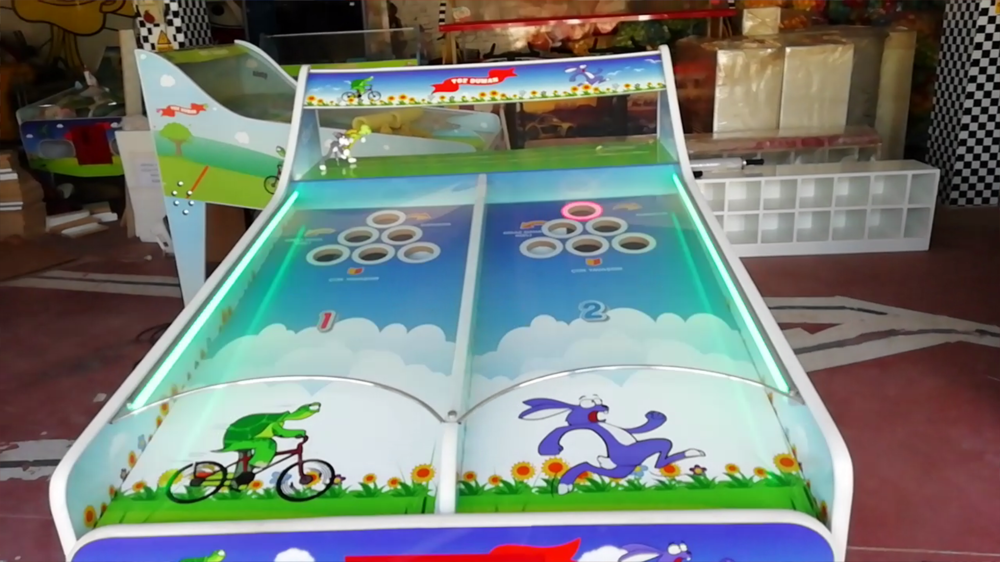
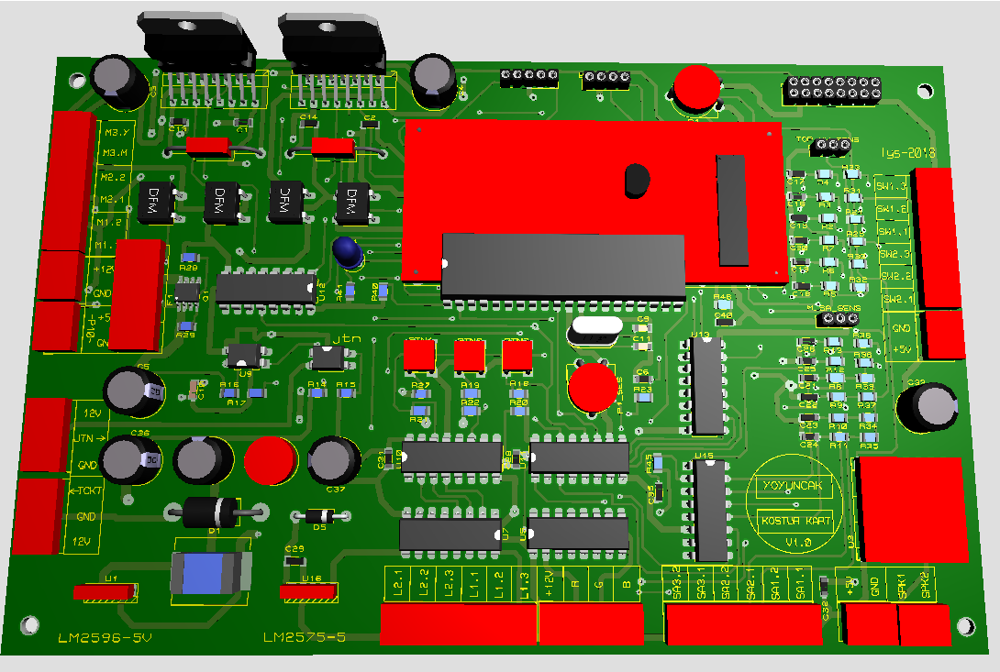
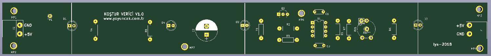
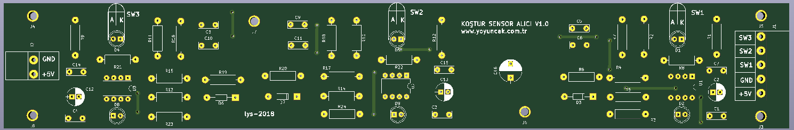

<h1 align="center">Koştur/Toz Duman/Car Racing Game Machine</h1>

## Contents
- [Overview](#Overview)
- [How it works?](#How-it-works)
- [Used technologies](#Used-technologies)

## Overview

<p  align="center">
    
</p>

This game machine is played by two people. There are 12 eyes, 6 on the left side and 6 on the right side. In front of the players is a horse, rabbit, turtle or car, depending on the machine belonging to each player. The game is played as horse racing if there are horses in front of the players, as dust and smoke if there are rabbits and turtles, and as car racing, if there are cars, and the name of the machine is given in this way.
 

## How it works?

When the machine is started, the objects to be raced are on the far left. Balls are given to the players. Objects are moved by inserting these balls into the eyes. The path taken by the object is different depending on the eye that is inserted. If a ball travels one unit when inserted into any of the three adjacent eyes, the distance travelled in one eye is three units. If the ball is put into either eye again while the object is travelling, the amount of travel is added to the previous one. The first one to the far right wins the game. At the same time, the game ends at the end of the playing time, in which case the person ahead wins.

<p  align="center">
    
</p

All functions of the game machine are controlled by a microcontroller-based main board. Game duration, amount of coins required for its operation, etc. Settings are made from the LCD on the card.

The game is played with game music. Each time the balls pass, transition music plays according to the eye.

<br>
<p  align="center">
    
     
</p>

The passage of the balls is detected by two infrared transceiver circuits and the appropriate signal level is created for the main board. A real-time algorithm was implemented in the programming, and as soon as the ball was detected, the engine was started, a separate transition music was played for each hole, and the relevant hole was illuminated.

By reading and calibrating the data analogously, the sensitivity of infrared LEDs to sunlight and ball colour was reduced, and transition detection was increased with the developed algorithm.

## Sensor working video...

<a href="https://www.youtube.com/watch?v=8aHo4yhkyYs" target="_blank">
     
</a>


## Used technologies

```bash
- PIC18F45K22 MCU.
- CCS PIC C Compiler
- Infrared movement detect.
- Motor drivers.
- Proteus PCB design.
- MP3 player

```

## Sample working video :

<a href="https://www.youtube.com/watch?v=SfRwXPxYxrk" target="_blank">
     
</a>


- GitHub [@your-ilyas9461](https://github.com/ilyas9461)
- Linkedin [@your-linkedin](https://www.linkedin.com/in/ilyas-yağcioğlu-6a6b17217)

### *** Note : 
Since the circuit is in industrial production, PCB circuit diagrams are not shared.
